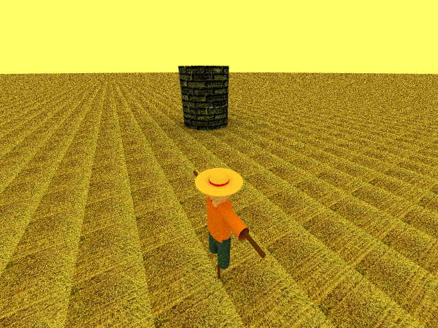
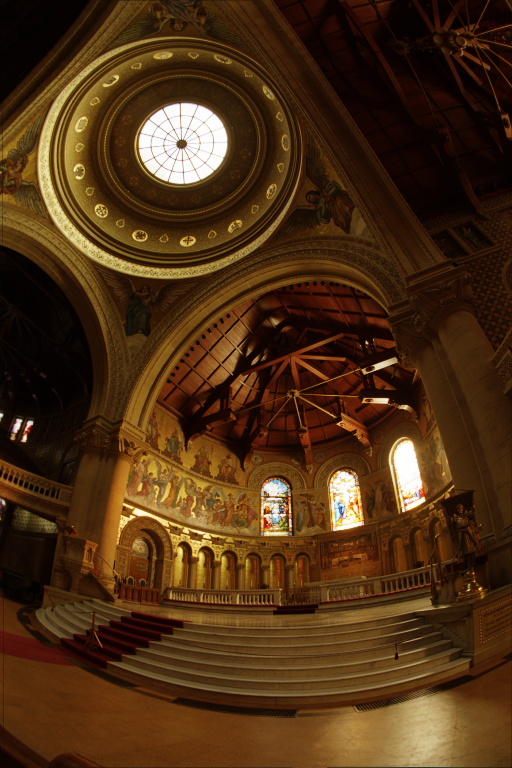
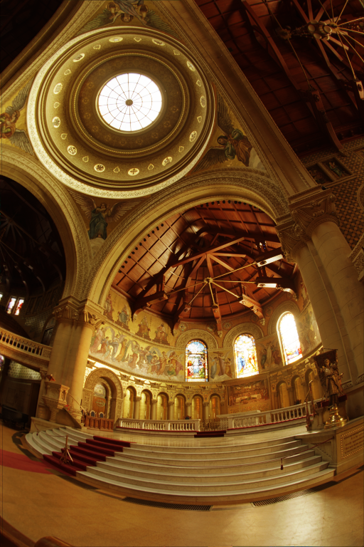

# RayCharles
A simple ray tracer which generates photorealistic images in pfm and png format. It also allows to convert an input pfm image into a new png image.

## Installation
To run the program on Linux, MacOS or Windows a D compiler is needed. Even though not mandatory, we strongly recommend to download also the package manager DUB. All the informations given here assume that the user had installed DUB.

**Compiler.** D official compiler `dmd` - version 2.098 or later - works perfectly fine, but latest version of `ldc2` offers better performances, generating images in roughly one third of the time. The D official site provides [downloads](https://dlang.org/download.html), including third-party downloads, and further informations about compilers. Note that `gdc`, part of `gcc` starting with version 9.0, is not supported at the moment.

**Package manger.** Details about DUB installation are provided on [DUB github page](https://github.com/dlang/dub#Installation) - latest version is the best choice. Be aware that upgrades via package management system may install a newer version than the [last release](https://github.com/dlang/dub/releases) and that most of the times it should not alarm.

## Usage
This command-line interface implements two functionalities: `render` generates a photorealistic image for a scene given in input as a txt, while `pfm2png` allows to convert a pfm file into a png one.

Moreover, a dedicated script allows to render a scene with different angles and create animations. This function uses the ldc2 compiler: if you feel confident read below to know how to select the compiler and modify properly the script RayCharles.sh.

**Render.** In order to use the ray tracer open the shell, enter the unzipped directory and build and run through

```bash
$ dub run -- render inputScene.txt
```

which saves the files output.pfm and output.png in the directory. The generation of new images will override any existing file in the directory with the same name. This could be very unfortunate since the output may be produced in several minutes. To avoid the risk provides names of your choice to RayCharles: this and other features are available for consultation typing `./RayCharles demo --help`.

IMPORTANT: to reduce the execution time require the use of a specific compiler through `dub run --compiler ldc2 -- demo` (DUB uses `dmd` by default).

**Pfm2png.** The same remains valid for the `pfm2png` command, except it requires two compulsory argument, i.e. the name of the image to convert and the output png file (the extension .png can be omitted). Using the alternative approach of building first and then executing:

```bash
$ dub build
$ ./RayCharles pfm2png image.pfm image.png
```

Again, `dub build --compiler ldc2` select another compiler (not particularly useful for this command). For more informations use the `--help` option.

**Animations.** It is also possible to generate animations: declare a variable named "angle" in the txt file to render and a camera which exploits this variable, then type in the shell

```bash
$ ./RayCharles.sh inputScene.txt animationName
```

and the file animationName.mp4 will be inserted into the animations subdirectory. All the frames are collected in the pngFrames subdirectory. By default the images are rendered with -d=3 and -spp=4 (see render help menu).

## Examples
**Render.**



**Pfm2png.**

|  |  |
| :---: | :---: |
| Gamma = 1.0, factor = 0.2 | Gamma = 1.0, factor = 0.4 |

**Animations.**

|  |  |
| :---: | :---: |

## License
The code is released under the GPL-3.0 [license](LICENSE).